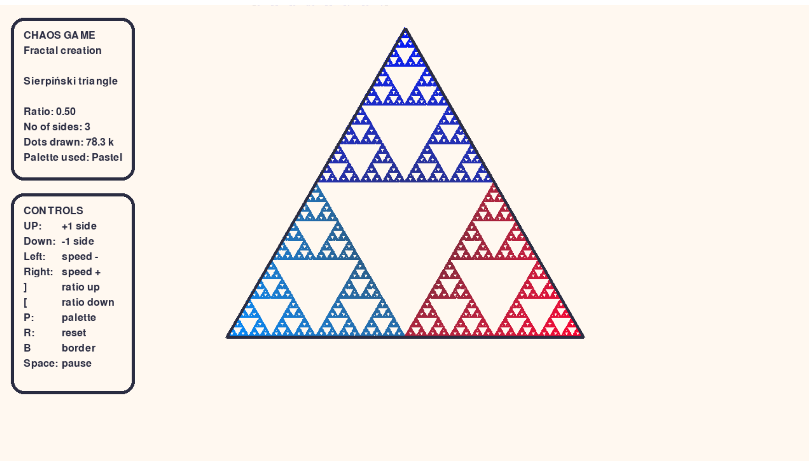
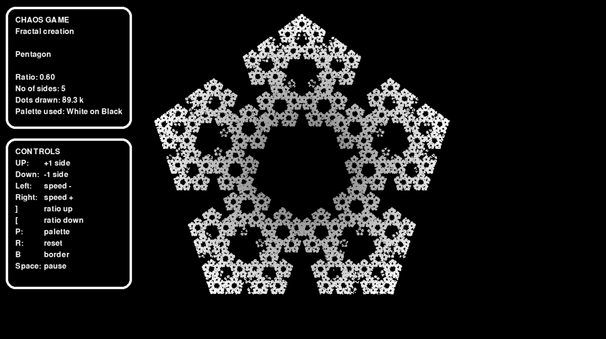
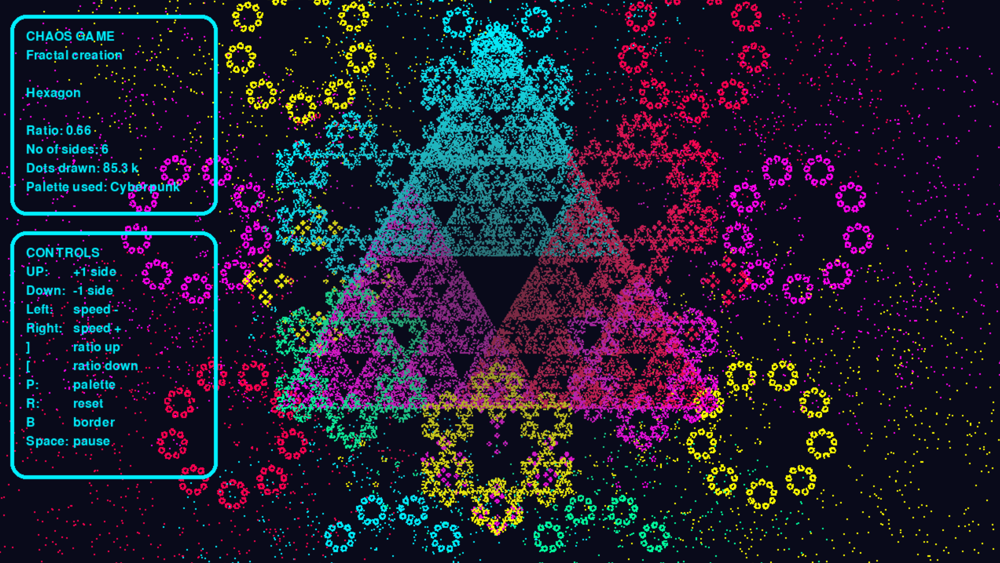
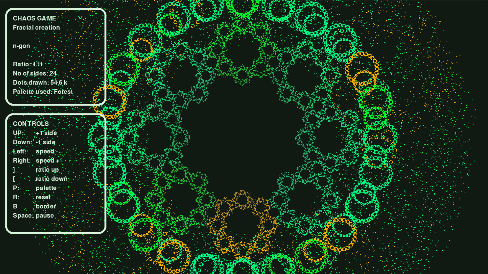

# Chaos game - Fractal Generator

### Video Demo: https://youtu.be/kV8x-fR8O-U
### Online version playable in a browser
https://sierra-wild-3d.itch.io/chaos-game-fractal-generator

### Description:
An interactive pygame visualizer for generating chaos game fractals. You can change the polygon, ratio, drawing speed, colour palette, and visibility of the main polygon while the fractal is being drawn.

#### Screenshots:

##### What the project does:
Generates fractals using chaos game theory.
We take any polygon, but for the sake of simplicity, let's imagine a triangle. We choose a point anywhere on the plane. Then we choose a random vertex from the triangle and travel half the distance towards it. There we draw a dot, and this becomes our new starting point. Repeat it thousands of times and you get interesting fractals.
Ratio is the distance of travel between the starting point and the randomly chosen vertex of the main polygon. Polygons with different numbers of vertices require different ratios.

##### How to run it:
You will need pygame-ce installed to run this project.
Open project.py and run it. No extra setup. All controls are on the screen in the UI panel.

##### Controls:
Arrow up: Adds a side to the main polygon

Arrow down: Subtracts a side from the main polygon

Arrow left: -10 speed

Arrow right: +10 speed

Right bracket: +0.1 ratio

Left bracket: -0.1 ratio

Plus sign above the bracket: +0.01 ratio

Minus sign above the bracket: -0.01 ratio

P: Change colours by choosing a random palette

R: Reset the whole drawing

B: Show/hide the main polygon

Space: Pause

Note that speed is printed to the console when you press the right or left arrow. It does not appear in the UI.

Fine adjustments to the ratio are not in the UI, so congratulations on reading the README file and finding the Easter egg.

Perfect ratios according to Wikipedia:

| Shape | Sides | Ratio |
|---|---:|---|
| Triangle | 3 | 0.5 |
| Square | 4 | 2/3 |
| Pentagon | 5 | 0.618 (golden ratio related) |
| Hexagon | 6 | 0.667 (2/3) |
| Octagon | 8 | 0.707 |

##### Files
**palettes.py** - contains all the palettes. Feel free to add your own. They all follow the same pattern, so it won't be too difficult to figure out how they work.

**project.py** - main file that contains the logic and all the functions. Run it to play the chaos game.

**README.md** - file you are reading now.

**requirements.txt** - list of packages that need to be installed to run the program.

##### Testing:
I'm testing most of the functions.
Functions like lerp2d, distance, or clamp are based on math, so they are easy to test, and I know the expected values and edge cases.

Tests like polygon name are not that useful, as they only test if the return gives me the name of the polygon that is predetermined. I decided to practice my test writing skill anyway.

Random palette tests if the palette is valid, doesn't have any missing aspects, and if it's added to the all_palettes variable so it can be chosen by the random_palette function in the main project file. Since I don't have a way to check all the variables in the file, I decided to run the test 100 times in a for loop. I know that there is a chance that some of the palettes can still be missed, especially if the number of palettes is larger, but this is the best design I came up with at the time.

##### Design choices:
I chose pygame because my first version of chaos game theory in turtle was too slow. Turtle treats every dot as an object. That made things slow as the amount of dots increased.

Secondly, I wanted to be able to control the parameters using the keyboard, and since pygame has built-in functions for that, it was a great choice.

Having two surfaces, one main surface and another where I draw the dots, helped with managing large amounts of dots, as I did not need to store the coordinates in a list, for example. If I did it again, I would use a transparent background for the surface that the dots are drawn on. This would allow me to change the palette without wiping the screen.

Initially, I intended to wipe the screen each time you made any change, like changing the ratio or the number of vertices in the main polygon. I even prepared a helper function that wipes everything in preparation for that. Before I implemented it in those places, I tried my program and I enjoyed the "drawing" aspect of it when I changed the parameters while it was still drawing. Coupled with a pause option, you can really tailor the effect you are going for.

The main polygon is drawn on the main surface instead of the dot surface, so it can be switched on or off without affecting the fractal itself. I think this is a neat feature that really adds to the experience.

##### What have I learned:
I have learned how to structure a project. I also learned about cleaning up the project, as I used lots of debugging lines and print statements during the creation of the program.

I learned about linear interpolation. At first I used the Pythagorean theorem to calculate the distance between the points. Later I abandoned that for lerp. I even improved it to fit my project better. Normally lerp will calculate one number, so I would have to do two calculations: one for the x value and one for the y value. I adapted it to suit my project and calculate them both at the same time.

Clamp is another function that I will take with me and use extensively in other projects. The ability to keep values in a range without overflowing can prevent many unexpected bugs and edge cases.

I would probably benefit from raising exceptions in those cases, but since I'm clamping the values and using the UI to control the parameters, I'm quite confident that those edge cases won't appear.

Boolean = not Boolean is a nifty trick to have an on and off switch with a minimal amount of code.

##### Why chaos game theory?:
I was watching some videos, and a mathematical channel that I follow explained the rules. I bet myself that I could make it without looking up any solutions. First I made it in the turtle module. When I look back at that project, there were some design choices that today I can only call questionable. This is the reason why I used the Pythagorean theorem first, as I did not know about linear interpolation (lerp) at the time. This is what fascinates me about programming and doing those projects. I can dive into a topic and then use it in my own projects instead of filing it as trivia that I can tell in a social gathering.

Another interesting thing I have learned by practice is that turtle treats everything as an object. My first version would slow down with the amount of dots on the screen. I adjusted it in code by drawing more dots at the same time, but that changed the way the fractal appeared on the screen. I had difficulties reaching over 100k dots. Using pygame allowed me to draw them on a surface, and I can easily draw over 1 million dots without a struggle.

##### Upcoming changes:
- Hide / Unhide UI
- Screenshot 